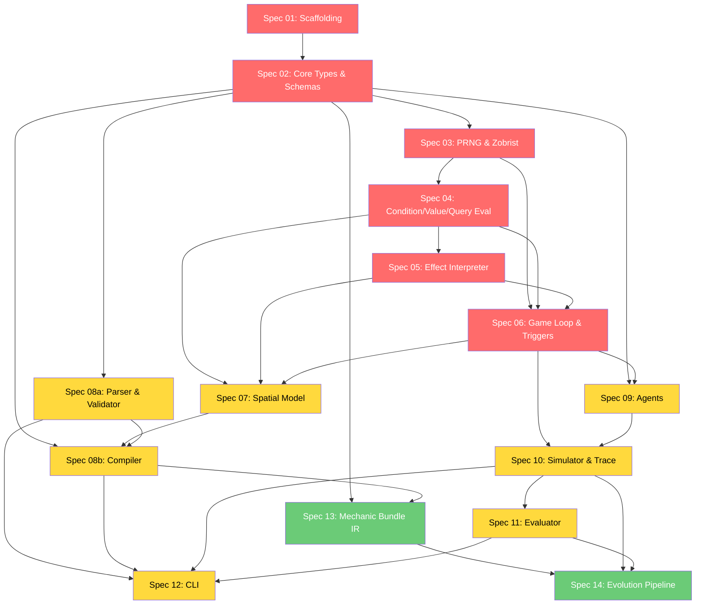

# Spec 00: Implementation Roadmap

**Status**: Draft
**Priority**: P0 (critical path)
**Complexity**: S
**Dependencies**: none
**Estimated effort**: 0.5 days
**Source sections**: All brainstorming doc sections (0-10 + appendices)

## Overview

Master roadmap for LudoForge-LLM implementation. Defines the dependency graph between all specs, milestone groupings, priority ordering, cross-spec integration points, parallel implementation opportunities, and risk registry. This document is the single source of truth for implementation sequencing.

## Dependency Graph



**Legend**: Red = P0 (critical path), Yellow = P1 (required for MVP), Green = P2 (post-MVP)

## Critical Path

```
01 (Scaffolding) -> 02 (Core Types) -> 03 (PRNG) -> 04 (Conditions) -> 05 (Effects) -> 06 (Game Loop) -> 07 (Spatial) -> 08b (Compiler) -> 12 (CLI)
```

This is the longest dependency chain and determines minimum time-to-MVP.

## Parallel Implementation Opportunities

| After completing... | These can run in parallel |
|---|---|
| Spec 02 (Core Types) | Spec 03 (PRNG) AND Spec 08a (Parser) |
| Spec 06 (Game Loop) | Spec 07 (Spatial) AND Spec 09 (Agents) |
| Spec 08b + Spec 10 | Spec 11 (Evaluator) AND Spec 12 (CLI) partially |

## Milestones

### Milestone 1: Kernel Foundation
**Specs**: 01, 02, 03, 04, 05, 06
**Gate**: Can run a hardcoded GameDef through the kernel with deterministic results.

**Verification criteria**:
- `initialState(gameDef, seed, playerCount?)` produces valid GameState
- `legalMoves(gameDef, state)` returns enumerable moves
- `applyMove(gameDef, state, move)` returns `{ state, triggerFirings }` with updated Zobrist hash in `state`
- Same seed + same moves = identical state hashes at every step
- Trigger chains capped at maxTriggerDepth
- `terminalResult` detects win/loss/draw conditions

**Integration points**:
- Spec 02 defines all types consumed by Specs 03-06
- Spec 03's PRNG is threaded through Spec 05 (effects) and Spec 06 (game loop)
- Spec 04's evaluators are called by Spec 05 (forEach queries, if conditions) and Spec 06 (preconditions, end conditions)
- Spec 05's effect interpreter is called by Spec 06 (move application, trigger dispatch)

### Milestone 2: Spatial + Compilation
**Specs**: 07, 08a, 08b
**Gate**: Can compile a Game Spec (Markdown+YAML) into a GameDef with spatial support.

**Verification criteria**:
- `parseGameSpec(markdown)` extracts sections in any order
- `validateGameSpec(doc)` catches missing/invalid sections
- `expandMacros(doc)` expands `grid()`, `hex()`, and compiler sugar
- `compileGameSpecToGameDef(doc)` produces valid GameDef JSON
- Spatial conditions/effects/queries work with zone adjacency
- Full pipeline: Markdown -> parse -> validate -> expand -> compile -> validateGameDef passes

**Integration points**:
- Spec 07 extends Spec 04 (spatial queries), Spec 05 (moveTokenAdjacent), Spec 06 (spatial triggers)
- Spec 08a produces GameSpecDoc consumed by Spec 08b
- Spec 08b uses Spec 07's board macros (grid, hex) and outputs GameDef validated by Spec 02

### Milestone 3: Full MVP
**Specs**: 09, 10, 11, 12
**Gate**: Can run bots on compiled games, evaluate quality, and use CLI commands.

**Verification criteria**:
- RandomAgent and GreedyAgent choose legal moves deterministically
- `runGame` produces complete GameTrace with state hashes
- `computeMetrics` returns all 7 metrics from trace data
- `detectDegeneracy` checks all 6 flags
- All 5 CLI commands work: spec:lint, spec:compile, run, eval, replay
- E2E: spec:compile -> run -> eval chain produces valid EvalReport

**Integration points**:
- Spec 09 agents call Spec 06's `legalMoves` and `applyMove`
- Spec 10 simulator uses Spec 06's game loop + Spec 09's agents
- Spec 11 evaluator reads Spec 10's GameTrace output
- Spec 12 CLI orchestrates Specs 08a, 08b, 10, 11

### Milestone 4: Evolution (post-MVP)
**Specs**: 13, 14
**Gate**: MAP-Elites evolution pipeline produces diverse, high-quality games.

**Verification criteria**:
- Mechanic bundles compose into valid GameSpecDocs
- MAP-Elites archive accepts games passing Tier 1 hard filters
- Generate-verify-feedback loop capped at 5 iterations
- Seed population provides diversity anchoring
- MissingCapability diagnostics aggregated across runs

**Integration points**:
- Spec 13 bundles produce patches consumed by Spec 08b's compiler
- Spec 14 uses Spec 10's simulator and Spec 11's evaluator for fitness assessment

## Spec Summary Table

| Spec | Name | Priority | Complexity | Dependencies | Est. Days | Milestone |
|------|------|----------|------------|--------------|-----------|-----------|
| 01 | Project Scaffolding & Build System | P0 | S | none | 1 | 1 |
| 02 | Core Types, Schemas & Validation | P0 | L | 01 | 3-4 | 1 |
| 03 | Deterministic Primitives (PRNG & Zobrist) | P0 | M | 02 | 2-3 | 1 |
| 04 | Kernel: Condition, Value & Query Eval | P0 | L | 02, 03 | 3-4 | 1 |
| 05 | Kernel: Effect Interpreter | P0 | L | 04 | 3-4 | 1 |
| 06 | Kernel: Game Loop & Triggers | P0 | L | 03, 04, 05 | 3-4 | 1 |
| 07 | Board-as-Graph Spatial Model | P1 | M | 04, 05, 06 | 2-3 | 2 |
| 08a | Game Spec Parser & Validator | P1 | M | 02 | 2-3 | 2 |
| 08b | Game Spec Compiler | P1 | L | 02, 07, 08a | 3-4 | 2 |
| 09 | Agents (Random & Greedy) | P1 | S | 02, 06 | 1-2 | 3 |
| 10 | Simulator & Trace Logger | P1 | M | 06, 09 | 2-3 | 3 |
| 11 | Evaluator & Degeneracy Detection | P1 | M | 10 | 2-3 | 3 |
| 12 | CLI | P1 | M | 08a, 08b, 10, 11 | 2-3 | 3 |
| 13 | Mechanic Bundle IR | P2 | L | 02, 08b | 3-5 | 4 |
| 14 | Evolution Pipeline | P2 | XL | 13, 10, 11 | 5-7 | 4 |

**Total estimated effort**: 35-52 days (MVP: 25-38 days, post-MVP: 8-12 days)

## Cross-Spec Integration Points

### Type Flow
```
Spec 02 (types) ─── consumed by ──→ ALL other specs
```

All type definitions live in Spec 02. Other specs import and use these types but never redefine them.

### API Contracts Between Specs

| Producer | Consumer | API |
|----------|----------|-----|
| Spec 03 | Spec 05, 06 | `createRng`, `nextInt`, `serialize`, `deserialize`, `fork` |
| Spec 03 | Spec 06 | Zobrist hash: `createZobristTable`, `zobristKey`, `computeFullHash`, `updateHashFeatureChange`, `updateHashTokenPlacement` |
| Spec 04 | Spec 05, 06, 07 | `evalCondition`, `evalValue`, `evalQuery` |
| Spec 05 | Spec 06 | `applyEffect`, `applyEffects` |
| Spec 06 | Spec 09, 10 | `initialState(def, seed, playerCount?)`, `legalMoves`, `applyMove` (returns `{ state, triggerFirings }`), `terminalResult` |
| Spec 07 | Spec 08b | `buildAdjacencyGraph`, `generateGrid`, `generateHex` |
| Spec 08a | Spec 08b | `parseGameSpec`, `validateGameSpec`, `GameSpecDoc` |
| Spec 08b | Spec 12 | `expandMacros`, `compileGameSpecToGameDef` |
| Spec 09 | Spec 10 | `Agent.chooseMove` (returns `{ move, rng }`), `RandomAgent`, `GreedyAgent` |
| Spec 10 | Spec 11, 12 | `runGame`, `GameTrace` |
| Spec 11 | Spec 12, 14 | `computeMetrics`, `detectDegeneracy`, `generateEvalReport` |

### Shared Infrastructure

| Infrastructure | Defined in | Used by |
|---|---|---|
| PRNG (Rng interface) | Spec 03 | Specs 05, 06, 09, 10 |
| Zobrist hashing | Spec 03 | Specs 06, 10, 11 |
| Diagnostic format | Spec 02 | Specs 08a, 08b, 12 |
| Zod schemas | Spec 02 | Specs 08a, 08b, 12 |

## Risk Registry

| Risk | Severity | Likelihood | Mitigation | Affected Specs |
|------|----------|------------|------------|----------------|
| PCG-DXSM TypeScript implementation complexity | Medium | Medium | Fall back to xoshiro256** which has simpler implementation | 03 |
| 64-bit Zobrist hashing in JS (no native 64-bit ints) | High | High | Use BigInt or two 32-bit integers; benchmark for performance impact | 03, 06 |
| Incomplete state hash coverage (phase/turn/order/action usage omitted) causing false loop/stall signals | High | Medium | Spec 03 requires hash coverage for all legal-move-relevant state and canonical feature encoding | 03, 06, 10, 11 |
| forEach/query interaction edge cases | Medium | Medium | Extensive property testing; fuzzing with random GameDefs | 04, 05, 06 |
| YAML 1.2 parser edge cases with LLM output | Medium | High | Build comprehensive linter for 20 known failure modes; golden tests from real LLM output | 08a |
| Compiler diagnostic quality insufficient for LLM self-correction | High | Medium | Test diagnostics against real LLM error patterns; iterate on suggestion quality | 08b |
| GreedyAgent lookahead performance for high branching factor | Low | Medium | Cap lookahead depth; use evaluation heuristic without full simulation | 09 |
| GameTrace size for long games | Low | Low | Implement delta compression; configurable trace verbosity | 10 |
| MAP-Elites archive dimensionality / bin sizing | Medium | Medium | Start with coarse bins; refine after observing distribution | 14 |
| Mechanic bundle namespace collision | Medium | Low | Strict prefixing; compiler validates uniqueness | 13 |

## Brainstorming Section Coverage

| Brainstorming Section | Covered by Spec(s) |
|---|---|
| 0) Guiding constraints | 02 (types enforce), 03 (determinism), 04-06 (bounded iteration) |
| 1.1) Structured Game Specification | 08a |
| 1.2) Mechanic Bundle IR | 13 |
| 1.3) GameDef JSON | 02 |
| 1.4) Runtime Logs | 02 (types), 10 (implementation) |
| 2.1A) Types | 02 |
| 2.1B) Validation | 02 |
| 2.1C) State initialization | 06 |
| 2.1D) Legal move enumeration | 06 |
| 2.1E) Move application | 06 |
| 2.1F) Condition evaluator | 04 |
| 2.1G) Effect interpreter | 05 |
| 2.1H) Trigger dispatcher | 06 |
| 2.1I) Terminal detection | 06 |
| 2.2A) Parser | 08a |
| 2.2B) Game Spec validation | 08a |
| 2.2C) Lowering/compilation | 08b |
| 2.2D) Macro expansion | 08b |
| 2.3) Agents | 09 |
| 2.4A) Simulator | 10 |
| 2.4B) Metrics | 11 |
| 2.4C) Degeneracy flags | 11 |
| 2.5) CLI | 12 |
| 2.6) Schemas | 02 |
| 3.1) References | 04 |
| 3.2) ConditionAST | 04 |
| 3.3) ValueExpr | 04 |
| 3.4) EffectAST | 05 |
| 3.5) OptionsQuery | 04 |
| 3.6) Selectors | 02 (types), 04 (resolution) |
| 4) Compiler contract | 08b |
| 5) Board-as-Graph Spatial Model | 07 |
| 6) Evolution Pipeline | 14 |
| 6.5) Fitness function tiers | 11 (metrics), 14 (fitness) |
| 7) Deterministic Engine | 03 |
| 8) Testing requirements | All specs (each has test section) |
| 9) MVP checklist | Specs 01-12 |
| 10) Exclusions | Referenced in relevant spec Out of Scope sections |
| Appendix A) Comparison | Informational (no spec needed) |
| Appendix B) References | Informational (no spec needed) |
